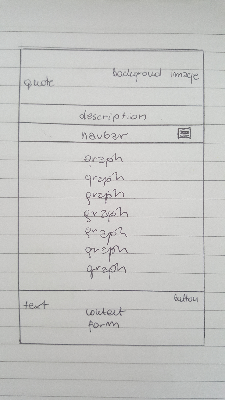
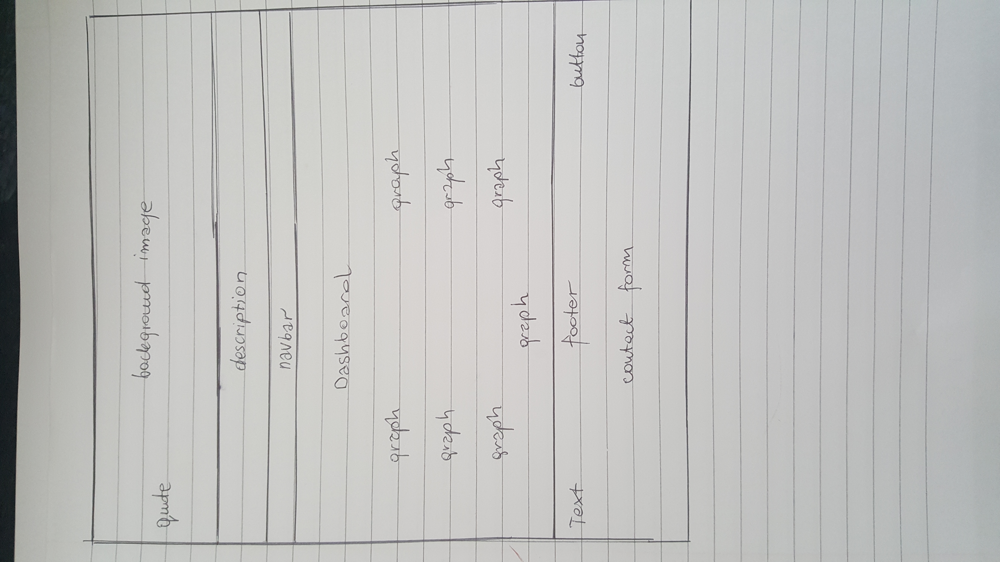

# Milestone Project 2 - Home - library

This project is about my home library collection. While most spaces in a home are meant for everyday routines, there's something special about a library that's strictly reserved for relaxation. 
 

This is one-page interactive website which include contact form in the footer and also seven different charts in the main section, such as: 

1. **"Year Of Purchase"** - pie chart,
1. **"Languages"** - bar chart,
1. **"Book Price"** - stacked chart,
1. **"Book Genre"** - pie chart,
1. **"Completly Read"** - bar chart,
1. **"Book Source"** - bar chart,
1. **"Author"** - bar chart

### UX

The purpose of this website is to showcase my home library. It provides users with general information about my collection. I am huge fun of reading books. 
I am obssesive book collector from a young age. I have so many lovely different ones so I selected 110 books only which I purchased for the past 6 years. 
The number of books in our homes are very important. In fact, the number of books that are in the home has a direct impact on literacy and education.
At the end of this page there is possibility to contact me. This is to encourage book lovers and also my website visitors to get in touch with me by filling the form.

##### Wireframes for mobile:

##### Wireframes for desktop:

### Features

##### Existing features:

* **Navbar** - is created to navigate to particular chart on the page. Across the navbar there are links with titles of the charts.
When hoover over - the color of the links is changing. For smaller devices the navbar collapse into *burder icon*.

* **Charts** - are created to provide general information about my home library. 

1. "Year of purchase": shows the balance of books I bought for the last six years.
1. "Language": shows the balance of languages in which my books are written.
1. "Book price": you can see the balance of spending money on books breaking down on languages.
1. "Book genre": shows the balance of types of my books.
1. "Completly read": you can see how many books in my library still need to be read by me.
1. "Book source": shows the source where I get my books from.
1. "Author": this is last chart which shows the balance of different authors. 

* **Contact form** - allows users to contact me by email and has been added in the footer of the page. The inputs are: *name*, *e-mail* and *message area*. 

##### Features left to implement:

* more charts (create more different type of charts to show more different information about the collection)

### Techonologies used

1. **HTML**: to create basic structure;
1. **CSS3**: to add styles to the website;
1. **JavaScript**: to make the page interactive; 
1. **Bootstrap**: https://getbootstrap.com/docs/3.3/ bootstrap 3.3.7 used for responsive navbar, grid layout
1. of the page;
1. **JQuery**: added to assist bootstrap;
1. **Bootswatch**: https://bootswatch.com/3/ for "back to top" button; 
1. **D3**: javascript library for manipulating documents based on data. To help bring data to life;
2. **DC**: javascript library (chart library) which provides prebuilt charts types for D3;
1. **Crossfilter**: javascript library which allows to work with data to make the chart rendered by DC interactive;
1. **Queue**: javascript library which allows to defer (books.json) calling a function untill the data is ready;
1. **EmailJS**: to allow user to contact with me; 
1. **Git**: used command line for regular commits and also to push my project to github;
1. **GitHub**: used to allow public to see my website; 

#### Testing

This website had been tested on different devices such as: Desktop, Tablet, Mobile. I used Chrome DevTools to make sure it works on: Samsung Galaxy S5, iPhone 5/6/7/8, iPad, PC Desktop;

#### Throubleshooting

1. *Navbar*: at first I wanted to use bootstrap grid to make it responsive, but I found it difficult to put seven
titles into 12 columns in one row. Thats why I did that differently with burger icon for mobile devices for better responsivnes;
1. *Chart*: chart called "Author" gave me lots of trouble to make it responsive especially on mobile devices;
My mentor recommended me to insert horizontal scroll bar;

#### To be fixed

1. *Responsivness*: the website was tested on different devices and the responsivness was perfect until I add my charts at the end to my main section.
   When testing on mobile - I am not sure what cause the white vertical space on the right (I need to double click on the page to adjust the page to the type of device);
1. *EmailJS*: it does not work properly (I could get an email but without the message);

### Deployment 

I deploy my project by going to GitHub, navigate to my github pages site's repository. Under my repository name I clicked Settings. Then I used the Select
drop-down menu to select master branch and then save it. Now my project is deployed to github pages and accessible to anyone via URL.

Link to my deployment version:  https://atena123.github.io/Home-library/

### Credits

#### Content

* the background image is from this website: https://www.google.com/search?rlz=1C1CHBF_en-gbIE812IE812&biw=1366&bih=657&tbm=isch&sa=1&ei=w3rYXKDlMfeU1fAPg46H8Ac&q=books+images&oq=books+images&gs_l=img.3..35i39j0l9.53635.53635..54992...0.0..0.52.52.1......1....1..gws-wiz-img.dKR68qh4zTc
* the quote is from the book **Pride and Prejudice** by *Jane Austin*, but really I found it on website.

#### Aknowlegment

my mentor:  Ignatius Ukwuoma - my help throughout the project;

